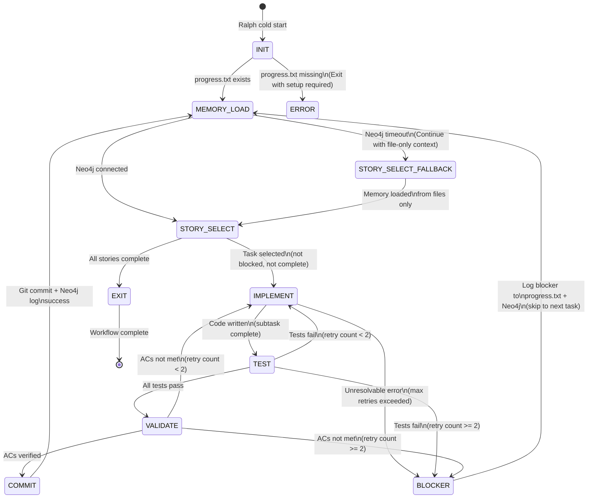

# Ralph-BMAD State Machine

The Ralph-BMAD integration uses a deterministic state machine to govern iteration flow, ensuring predictable behavior across agent spawns.

## State Diagram



## State Definitions

| State | Entry Criteria | Exit Criteria | Failure Transition |
|-------|---------------|---------------|------------------|
| **INIT** | Ralph spawned | `progress.txt` readable | → ERROR (if missing) |
| **MEMORY_LOAD** | `progress.txt` loaded | Brooks memory search complete | → STORY_SELECT_FALLBACK (Neo4j timeout) |
| **STORY_SELECT** | Memory context loaded | Next task identified | → EXIT (if all complete) |
| **STORY_SELECT_FALLBACK** | Neo4j unavailable | File-only memory loaded | → STORY_SELECT |
| **IMPLEMENT** | Task selected, retry < 3 | Code written, files modified | → BLOCKER (if unresolvable) |
| **TEST** | Implementation complete | Tests executed | → IMPLEMENT (fail, retry < 2) / → BLOCKER (fail, retry >= 2) |
| **VALIDATE** | Tests pass | ACs verified against story | → IMPLEMENT (fail, retry < 2) / → BLOCKER (fail, retry >= 2) |
| **COMMIT** | ACs pass | Git commit + Neo4j event logged | → MEMORY_LOAD (next iteration) |
| **BLOCKER** | Max retries exceeded | `progress.txt` updated + Neo4j logged | → MEMORY_LOAD (continue with other tasks) |
| **EXIT** | All stories complete | Final summary written | → [*] |
| **ERROR** | Required files missing | Setup instructions provided | → [*] |

## State Details

### INIT

**Purpose:** Cold start validation

**Entry Actions:**
- Verify current directory has `.git`
- Check for `progress.txt`
- Load `prd.json` if exists

**Exit Conditions:**
- Success: progress.txt exists → MEMORY_LOAD
- Failure: progress.txt missing → ERROR

**Error Output:**
```
<promise>SETUP_REQUIRED</promise>
Explanation: progress.txt not found. Create with template.
```

### MEMORY_LOAD

**Purpose:** Load context from all persistence layers

**Entry Actions:**
- Read `progress.txt`
- Read `prd.json`
- Read `.claude/CLAUDE.md`
- Attempt Neo4j memory search

**Neo4j Queries:**
```cypher
// Query A: Agent context
MATCH (n) WHERE n.name CONTAINS 'Brooks' OR n.name CONTAINS 'Developer Agent'
RETURN n LIMIT 10

// Query B: Known issues
MATCH (n) WHERE n.memoryType IN ['blocker', 'bug', 'technical_debt']
RETURN n ORDER BY n.date DESC LIMIT 10
```

**Exit Conditions:**
- Neo4j successful → STORY_SELECT
- Neo4j timeout → STORY_SELECT_FALLBACK

**Retry Policy:**
- Wait 3 seconds, retry once
- If still failing → fall back to file-only

### STORY_SELECT

**Purpose:** Determine next actionable task

**Selection Algorithm:**
1. Find `status: in_progress` stories
2. If none, find first `status: not_started`
3. For selected story, locate story file
4. Find first unchecked subtask
5. If all complete, mark story complete

**Priority Order:**
```yaml
priority:
  - in_progress (active task)
  - not_started (next story)
  - blocked (skip - needs human)
  - complete (skip)
```

**Exit Conditions:**
- Task found → IMPLEMENT
- All stories complete → EXIT

### STORY_SELECT_FALLBACK

**Purpose:** Continue without Neo4j

**Entry Actions:**
- Log warning: "Neo4j unavailable, using file-only context"
- Set `current_iteration.neo4j_connected: false`
- Queue Neo4j backfill for next successful connection

**Exit:** → STORY_SELECT

### IMPLEMENT

**Purpose:** Execute red-green-refactor cycle

**Entry Actions:**
- Read story file
- Identify acceptance criteria
- Apply Brooks' Principles

**RED Phase:**
- Write failing test
- Verify test fails as expected
- Do not write more than minimal failing test

**GREEN Phase:**
- Write minimal code to pass
- No optimization, no cleanup
- Just make it pass

**REFACTOR Phase:**
- Clean code while keeping tests green
- Rename variables, extract functions
- Do not change behavior

**Exit Conditions:**
- Success → TEST
- Failure → retry increment → IMPLEMENT or BLOCKER

### TEST

**Purpose:** Verify implementation

**Entry Actions:**
- Run TypeScript check: `tsc --noEmit`
- Run lint: `pnpm lint`
- Run unit tests: `pnpm test`
- Run e2e if applicable: `playwright test`

**Failure Handling:**
- Log failure to stdout
- Capture error output
- If retry_count < 2 → IMPLEMENT (retry)
- If retry_count >= 2 → BLOCKER

**Exit Conditions:**
- All green → VALIDATE
- Any failure → retry or BLOCKER

### VALIDATE

**Purpose:** Verify against acceptance criteria

**Entry Actions:**
- Check each AC from story file
- Verify implementation matches requirements
- Do not infer beyond explicit ACs

**Exit Conditions:**
- ACs met → COMMIT
- ACs not met → IMPLEMENT (retry) or BLOCKER

**Validation Template:**
```
AC-1: [requirement text] - ✓ [implementation evidence]
AC-2: [requirement text] - ✓ [implementation evidence]
AC-3: [requirement text] - ✗ [reason for failure]
```

### COMMIT

**Purpose:** Persist completed work

**Entry Actions:**
1. Update `progress.txt`:
   - Mark subtask complete
   - Update `current_task: next-task-id` or `null`
   - Reset `retry_count: 0`
   - Update `last_updated: now`

2. Git commit:
   - Atomic commit for subtask
   - Message includes story and task IDs
   - Include Neo4j event ID if logged

3. Neo4j log (best effort):
   - Event type: `BROOKS_TASK_COMPLETE`
   - Link to commit hash

**Exit:** → MEMORY_LOAD

### BLOCKER

**Purpose:** Handle unresolvable failures

**Entry Actions:**
1. Increment `retry_count`
2. Update `progress.txt`:
   - Set `status: blocked` (if retry_count >= 2)
   - Add `blocker_reason`
   - Set `blocker_type: transient|permanent`
   - Set `requires_human: true`

3. Log to Neo4j:
   - Event type: `BROOKS_TASK_BLOCKER`
   - Include: reason, attempted_fixes, fix_sources_tried

**Exit:** → MEMORY_LOAD (continue with other tasks)

**Blocker Resolution:**
- Human edits `progress.txt`
- Sets `status: in_progress`
- Resets `retry_count: 0`
- Removes `blocker_*` fields

### EXIT

**Purpose:** Graceful termination

**Entry Actions:**
1. Write final summary
2. Update metrics in `progress.txt`
3. Git commit all changes

**Output:**
```
<promise>COMPLETED</promise>

Summary:
- Stories completed: 3
- Total iterations: 47
- Final commit: abc123
- Time elapsed: [duration]
```

## Decision Logic

### Retry vs Blocker

```python
def transition_from_test(success, retry_count):
    if success:
        return VALIDATE
    if retry_count < 2:
        return IMPLEMENT  # retry
    return BLOCKER

# Same logic for all TEST and VALIDATE failures
```

### Transient vs Permanent Blockers

**Transient (may auto-retry after delay):**
- Network timeouts
- Database connection issues
- External service unavailable

**Permanent (requires human):**
- Test framework missing
- Dependency conflict
- Domain logic gap

**Auto-Retry Rule:**
- If `blocker_type: transient` AND 3 iterations passed
- Retry once automatically
- If fails again → permanent blocker

### Context Window Management

| Threshold | Action |
|-----------|--------|
| < 70% | Normal operation |
| 70% | Soft warning - skip nice-to-haves |
| 80% | Hard escalation - commit and exit |

**Hard Escalation:**
- Write context summary
- Commit all work
- Output `<promise>CONTEXT_EXHAUSTED</promise>`
- Ralph respawns fresh

## Error Handling

### Required File Missing

→ ERROR state
- Output setup instructions
- Do not modify code
- Provide template for missing file

### Git Failure

→ BLOCKER (if unresolvable)
- Log git error
- If working tree dirty → BLOCKER
- If merge conflict → BLOCKER

### Test Runner Missing

→ BLOCKER
- Cannot run required tests
- Story incomplete without test coverage
- Human must install test framework

## State Machine Initialization

```bash
# From repo root
source ~/.bashrc

# Verify prerequisites
[ -f progress.txt ] || echo "ERROR: progress.txt missing"
[ -f .claude/CLAUDE.md ] || echo "WARNING: CLAUDE.md not found"

# Start Ralph iteration
ralph "Execute next BMAD story subtask" \
  --agent opencode \
  --prompt-template ralph_prompt.md
```

## Monitoring

**Check current state:**
```bash
# Read from progress.txt
yq '.stories[] | select(.status == "in_progress")' progress.txt
```

**Iteration progress:**
```bash
ralph --status
```

**Inject context:**
```bash
ralph --add-context "Hint for next iteration"
```
